# Paralympic Dataset

This dataset was part of the DataDNA dataset competition for Septemeber 2024. Link: https://onyxdata.ck.page/datadna-sep-2024
Raw dataset folder: raw_data
Modified dataset folder: manipulated_data

# Analysis Objectives

In this analysis I sought to identify:
 * which countries and regions are more dominant during paralympic events.
 * Does hosting event improve chances of winning more medals

# Notebooks and other Python files

There are 4 files: 2 notebooks of analysis and 2 python files for common formula and making plots

# Analysis

## Medals distribution

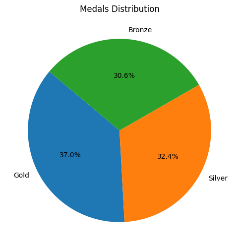

* In total ***there are more gold medals*** which have been won followed by silver and then bronze
* 

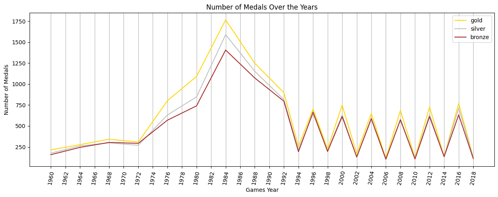

* In 1984 was when the most of the medals were won. A total of 4762
* In 2006 was when the least number of medals won. A total of 320.
* In all the years the number of gold medals won is always highest compared to other medals
* From 1994, the pattern of medals won follows a zig-zag or alternate pattern (low -> high -> low -> high, repeat)
* Prior to 1992, paralympics used to occur in 4 years interval. From 1994 onwards the period has reduced to 2 years

## Summer and Winter events

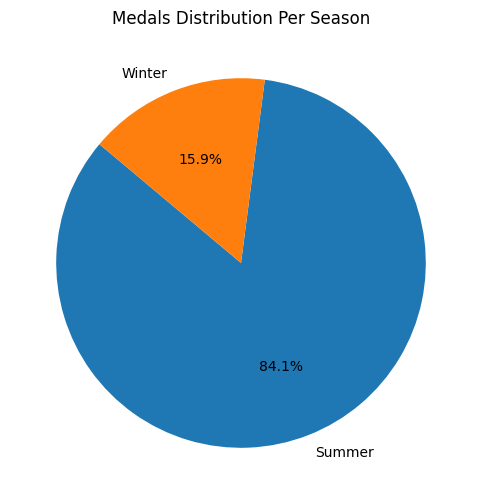

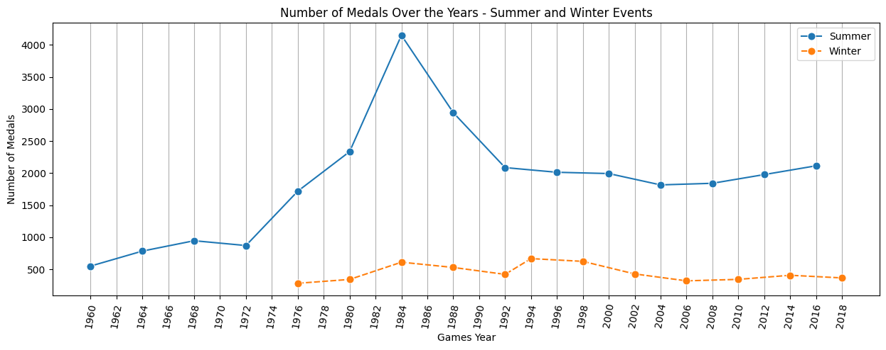

* In total, there are 28 149 (84.1%) and  5 340 (15.9%) medals won in summer and winter events, respectively.
* Paralympics were initially held in summer only until 1976 where the first paralympic were was held
* Between 1976 and 1992, summer and winter paralympics events were held in the same year (i.e. in one year there were summer and winter paralympics games)
* The events held in summer always have more medals won compared to winter events
* From 1994, winter and summer events alternate (e.g. Winter event in 1994 and summer event in 1996 and repeat). Therefore the zig-zag pattern observed in the plot above is explained by this alternating pattern.
* Thus the pattern of four years has remained over the time. Summer events are 4 years and winter events are 4 years as well between each other.

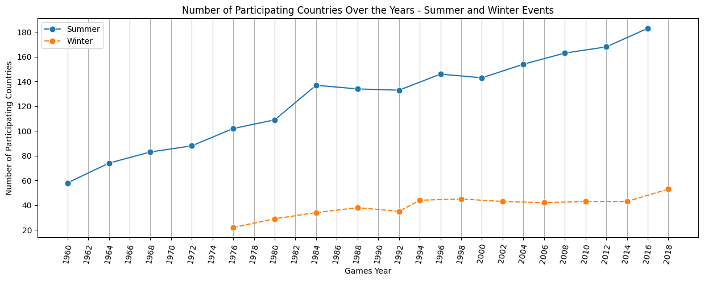

* The number of participating countries in winter are fewer compared to those who participate in summer.
* The number of participating countried during both winter and summer events have been increasing over the years. However the number of countries participating in winter events remained relatively the same between 1994 and 2014

* A total of 15 summer events were held while only 12 winter events were held with the latest one being a winter event.
* An average of 125 countries participate in summer eevents while an average of 39 countries participate in winter events
* A minimum of 58 countries participated in one summer event while a minimum of 22 countries participated in winter events. Both of this events were at the very beginning of both summer and winter events.
* A maximum of 150 countries participated in summer events and 53 participated in winter events. Both maximum number of participating countries occured in the last year of the dataset.

* An average of 15 and 4 different sports are played in summer and winter paralympics events, respectively.
* More sporting events occur in summer than in winter
* Only a maximum of 6 different sports are played in winter which is lower than a maximum of 22 sports played in summer.

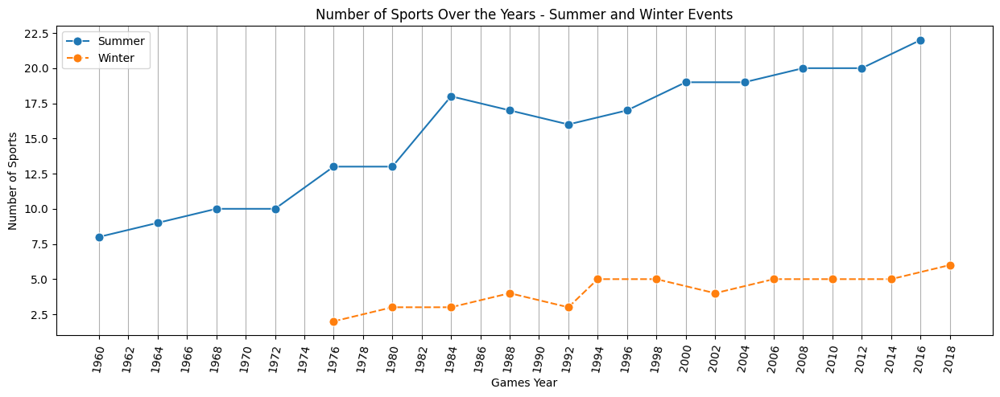

* The number of sports played in both winter and summer events have increased over the years.
* There are fewer sports played and contries participating in winter events compared to summer.
* Therefore there are fewer opportunities to collect medals in winter compared to summer hence there are differences in medals collected in both events

## Summer and Winter Sports

* Summer Sports: 'Athletics', 'Archery', 'Table Tennis', 'Wheelchair Basketball', 'Wheelchair Fencing', 'Swimming', 'Snooker', 'Dartchery', 'Weightlifting', 'Lawn Bowls', 'Shooting', 'Goalball', 'Volleyball', 'Wrestling', 'Powerlifting', 'Football 7-a-side', 'Equestrian', 'Boccia', 'Cycling', 'Judo', 'Wheelchair Tennis', 'Sailing', 'Wheelchair Rugby', 'Basketball ID', 'Football 5-a-side', 'Rowing', 'Canoe' and 'Triathlon'
* Winter Sports: 'Alpine Skiing', 'Cross-Country', 'Ice Sledge Speed Skating', 'Biathlon', 'Para Ice Hockey', 'Wheelchair Curling', 'Snowboard'
* There are 28 and 7 different summers and winter sports, respectively.
* No sport played in winter are played in summer and vice versa.

# Country Participation

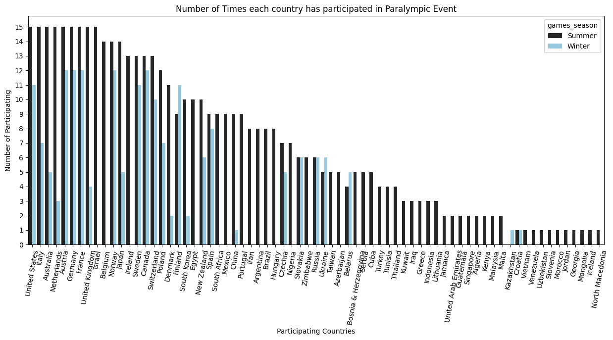

* There are some countries which only participate in winter or summer events and there are those who participate in both events
* 1 Country(ies) only participate in Winter Events: ['Kazakhstan']

* 44 Country(ies) only participate in Summer Events: ['Israel', 'Belgium', 'Ireland', 'Egypt', 'South Africa', 'Mexico', 'Portugal', 'Iran', 'Argentina', 'Brazil', 'Hungary', 'Nigeria', 'Zimbabwe', 'Azerbaijan', 'Bosnia & Herzegovina', 'Serbia', 'Cuba', 'Taiwan', 'Tunisia', 'Thailand', 'Turkey', 'Kuwait', 'Iraq', 'Greece', 'Indonesia', 'Lithuania', 'Algeria', 'Malta', 'Malaysia', 'Kenya', 'United Arab Emirates', 'Singapore', 'Guatemala', 'Jamaica', 'Vietnam', 'Venezuela', 'Uzbekistan', 'Slovenia', 'Morocco', 'Jordan', 'Georgia', 'Mongolia', 'Iceland', 'North Macedonia']

* 26 Country(ies) participate in both Summer and Winter Events: ['United States', 'Germany', 'United Kingdom', 'France', 'Italy', 'Austria', 'Netherlands', 'Australia', 'Norway', 'Japan', 'Sweden', 'Canada', 'Switzerland', 'Poland', 'Denmark', 'South Korea', 'New Zealand', 'Spain', 'Finland', 'China', 'Czechia', 'Russia', 'Slovakia', 'Ukraine', 'Belarus', 'Croatia']

* Kazakhstan have participated once in 2018 and it was a winter event and they won one medal which was Gold from Cross Country sport.
* There are 2 304 (6.88%) medals won by the countries which only participate in summer events.
* There are 31 062 (92.75%) medals won by countries which participate in both summer and winter events.

# Dominant Countries

## Top 10 countries with most medals

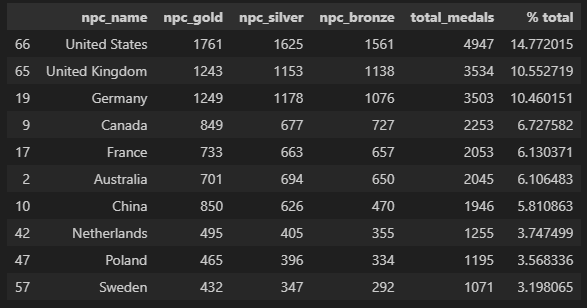

## Bottom 10 countries with least medals

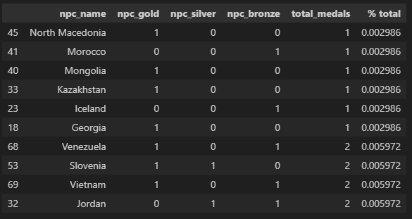

## Country with most medal each year

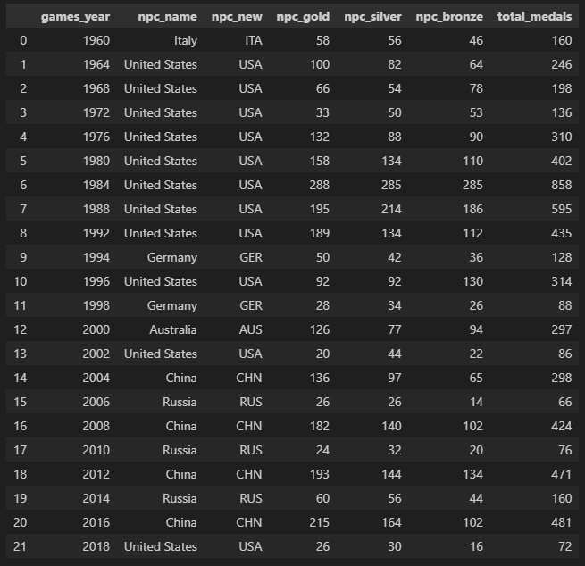

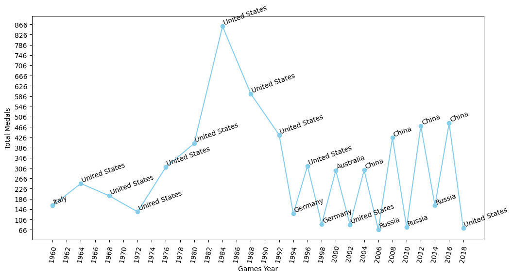

* USA have dominated the paralympic events. In 22 years of events being held, USA have come as number 1 in 11 occassions.
* Italy which dominated the first paralympic event in 1960 have never repeated that feat in subsequent years.
* Between 2006 and 2016, the events were dominated by Russia and China. With Russia dominating winter events and China dominating summer events.
* Australia is another country which dominated once and haven't repeated that again. That was in the year 2000 in summer events.
* Germany dominated winter events in year 1994 and 1998
* Considering the countries which have dominated the paralympics events over the years, these are first world countries. Countries with better economy, higher GDP and highly industrialized and therefore from these countries you would expect athletes who are well funded, have access to better equipment, training and support and contribute most number of qualifying athletes to these events.

## Top and bottom 5 countries each year

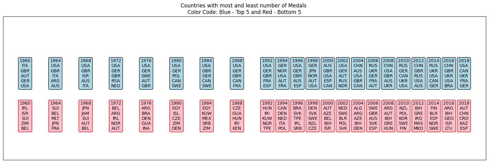

* No African or South American Country have been in the Top 5 of any paralympic events except for South Africa in 1972 in number 4 and Brazil in 2016 in number 5
* South American and African countries appear in the botton 5 countries. Countries such as Egypt, Kenya and Zimbabwe from Africa and Argentina and Brazil from South America.
* Some of European and Asian countries also appear in the bottom 5. Of note are Italy, Austria and China who once or more appeared in the top 5.

# Events Locations

**Hosting Countries**
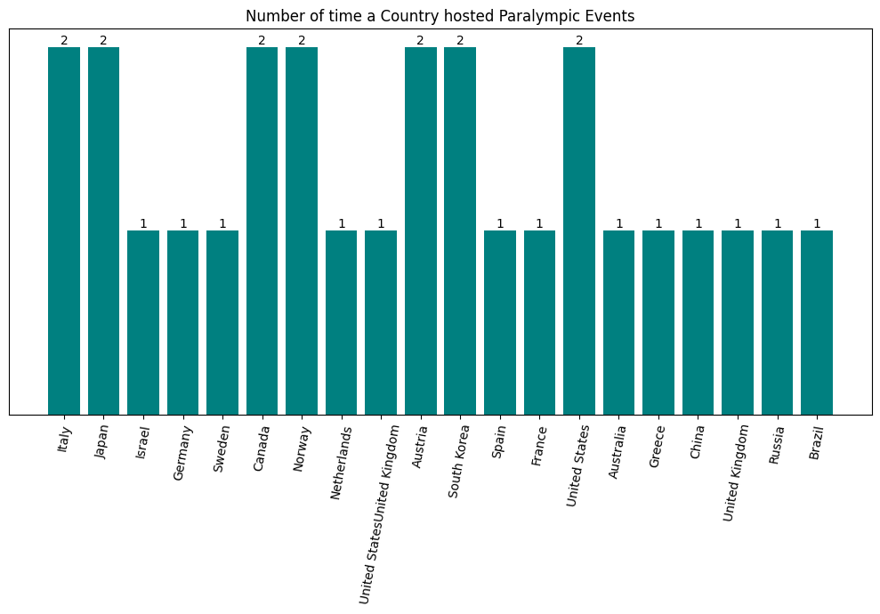

**Hosting Cities**
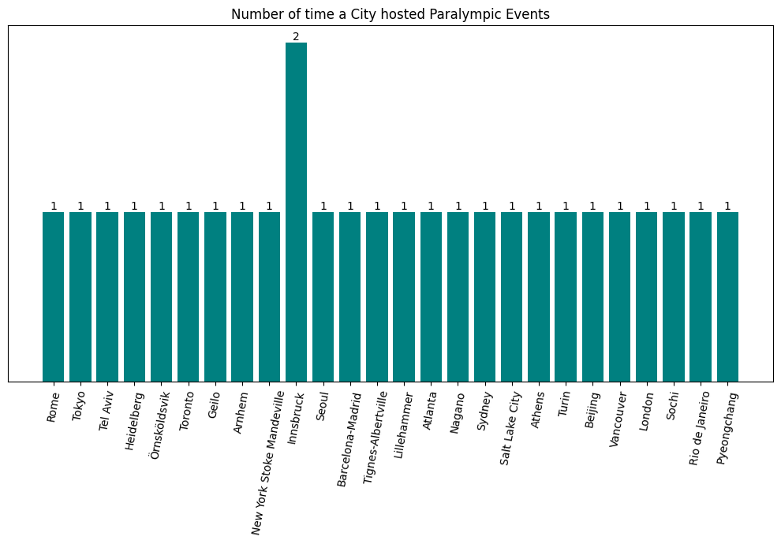

**Hosting Continent**
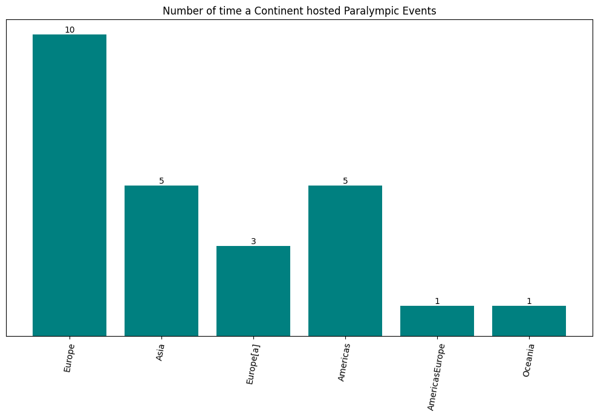

* All the events have been hosted this in the northern hermisphere and mostly in Europe. The only exception was when the events were held in Australia and Brazil.
* The hosting nations are from Europe, Asia and America with Europe dominated with 13 occassions where they played host to this events.
* The hosting countries/cities have great financial status.
* Only 1 city have hosted the events twice which is innsbruck in Austria.
* Of note, is that none of African countries have hosted the events even tho they have participated.

# Impact of hosting on country's success

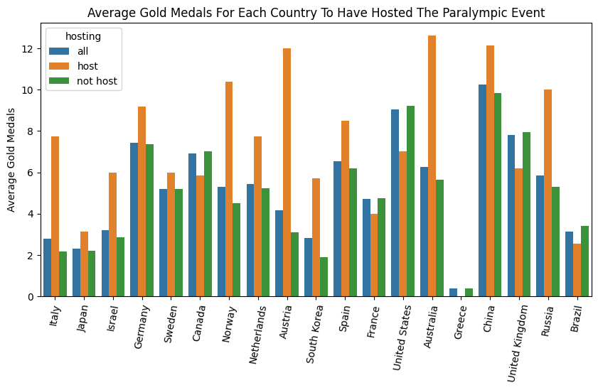

* On Average, countries have more Gold medals when hosting paralympic events than when not hosting. There is exception, tho, for Canada, France, USA, UK and Brazil. Canada, UK and USA have hosted the events twice or more. 
* This means hosting an event increases the chances of a country winning more gold medals

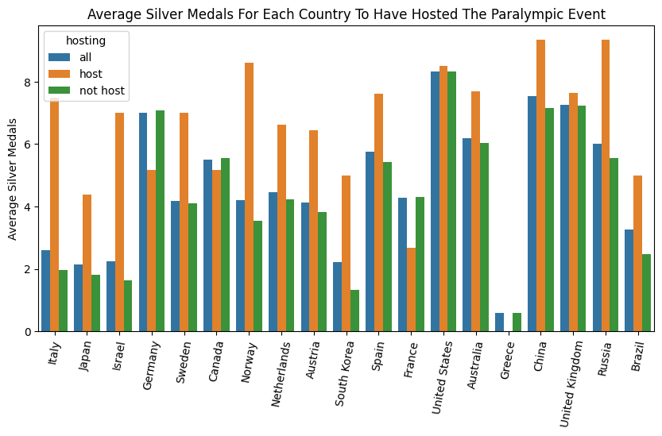

* On Average, countries have more Silver medals when hosting paralympic events than when not hosting. There is exception, tho, for Germany, Canada and France. Canada have hosted the events twice while Germany and France have hosted once. 
* This means hosting an event increases the chances of a country winning more silver medals

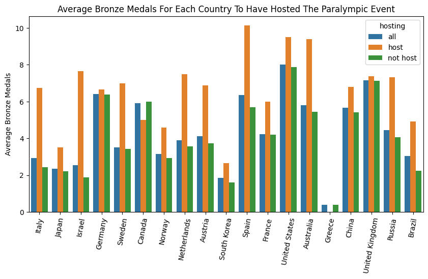

* On Average, countries have more bronze medals when hosting paralympic events than when not hosting.
* This means hosting an event increases the chances of a country winning more bronze medals

**Overall Summary:**

* All the countries have won at least one medal when hosting a paralympic event except for Greece which hosted once in 2004
* If a country want to win more medals, they must host the event(s). **Note: There have been complaints in the news of countries complaining about heavy economic stress of hosting olympics and paralympics events due to lack of financial support from The International Olympics Committee. Link: https://gjia.georgetown.edu/2021/04/19/why-cities-no-longer-clamor-to-host-the-olympic-games/ and https://theconversation.com/fewer-cities-can-afford-to-host-the-olympics-but-paris-2024-may-be-clever-enough-to-turn-a-profit-235480
* All countries to have ever hosted the events have more bronze medals compared to when they were not hosting.
* While the chances of winning more silver and gold medals is high when hosting the events. There are some countries which have seen the opposite. Countries such as Canada and France have not reaped rewards of hosting events.

# Medals per sport

* Athletics, Swimming and Alpine Skiing are the most popular sports. They have the most number of medals
* Basketball only have two medals
* Individual sports are have more medals compared to team sports. Perhaps due to the nature that team sports take longer compared to individual sports